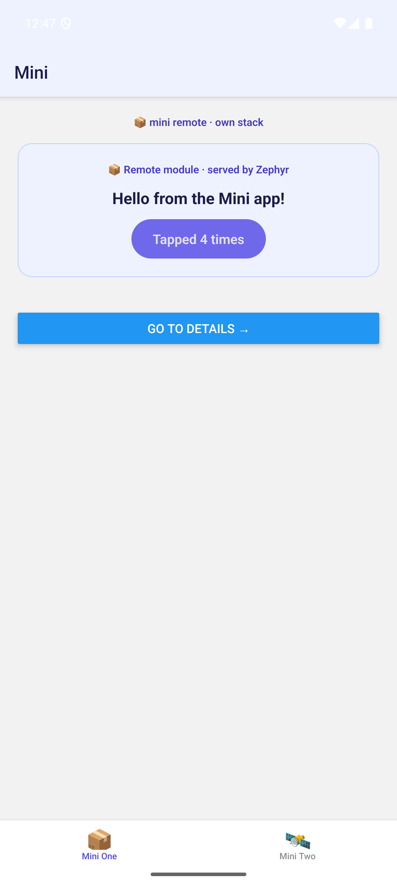
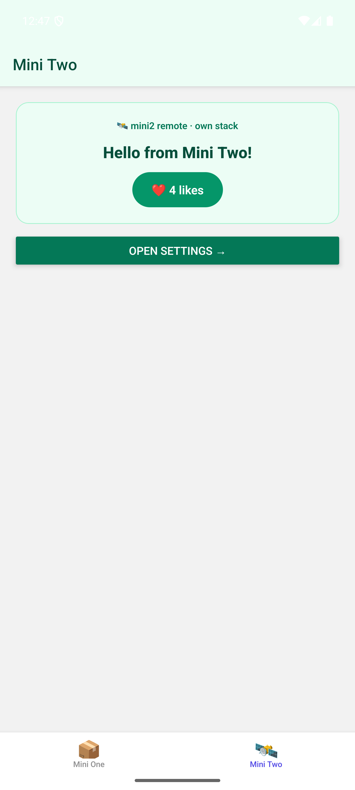
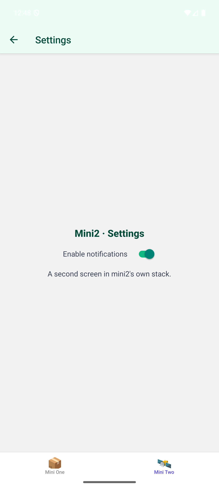

# Zephyr + Metro (React Native) — Module Federation demo

A React Native micro-frontend setup demonstrating [Zephyr Cloud](https://app.zephyr-cloud.io/)
deployment through the **Metro** bundler using **Module Federation**.

- **`apps/host`** — the shell. Owns a single `NavigationContainer` and a
  **bottom-tab navigator** with two tabs. Each tab renders a remote loaded at
  runtime; no remote code ships in the host binary.
- **`apps/mini`** — remote (`:8082`). Exposes `./MiniApp`: a **stack navigator**
  (Home → Details).
- **`apps/mini2`** — remote (`:8083`). Exposes `./MiniApp`: its own **stack
  navigator** (Home → Settings).

```
host (NavigationContainer)
└─ Bottom Tabs
   ├─ Tab "Mini One" ──▶ mini/MiniApp   (own Stack: Home → Details)   from :8082
   └─ Tab "Mini Two" ──▶ mini2/MiniApp  (own Stack: Home → Settings)  from :8083
```

Each remote controls its own navigation stack inside the host's tab. This works
across the federation boundary because `@react-navigation/native`,
`react-native-screens`, and `react-native-safe-area-context` are declared as
**shared singletons**, so every remote uses the host's single navigation
context and one native screens instance.

<p align="center">
  
  
  
</p>

## Demo

Deploying the remotes to Zephyr Cloud, then the host on the Android emulator
loading both remotes from their hosted URLs (local remote servers off):

<video src="https://github.com/Suren-Sargsyan14/zephyr-metro-setup/raw/main/docs/demo.mp4" controls width="640"></video>

▶️ If the player doesn't load, [watch/download the clip directly](https://github.com/Suren-Sargsyan14/zephyr-metro-setup/raw/main/docs/demo.mp4).

## Prerequisites

- Node ≥ 18 (tested on 22), npm ≥ 10
- Xcode + iOS simulator (for iOS). CocoaPods works on Ruby 2.7.6 here (the RN
  0.86 `Gemfile` pins compatible gems); the doc's "Ruby ≥ 3.3.2" was stricter
  than needed in practice.
- Android SDK + an emulator (for Android)
- A Zephyr Cloud account and CLI login (`npx zephyr login`) — only for deploys

## Install

```bash
cd apps/host  && npm install
cd ../mini    && npm install
cd ../mini2   && npm install
```

## How the Metro config is structured (each app)

| File | Purpose |
|------|---------|
| `metro.mf.config.js` | Plain Module Federation (no Zephyr) — local dev |
| `metro.zc.config.js` | Same MF options wrapped in `withZephyr()` — deploy |
| `metro.config.js`    | Picks one based on the `ZC` env var (`ZC=1` → Zephyr) |

## Run locally (no Zephyr)

```bash
# terminal 1 — remote 1
cd apps/mini  && npm start          # Metro on :8082

# terminal 2 — remote 2
cd apps/mini2 && npm start          # Metro on :8083

# terminal 3 — host
cd apps/host  && npm start          # Metro on :8081
npm run ios                         # or: npm run android
```

**Android only** — the emulator's `localhost` is the device, so forward the
remote ports (Metro auto-forwards :8081 but not the remotes):

```bash
cd apps/host && npm run adbreverse   # adb reverse tcp:8082 + tcp:8083
```

(iOS simulators share the Mac's network, so no forwarding is needed.)

## Deploy to Zephyr Cloud

```bash
npx zephyr login                                 # one-time browser OAuth

cd apps/mini  && npm run build:android:zephyr    # deploy remote 1
cd ../mini2   && npm run build:android:zephyr    # deploy remote 2
cd ../host    && npm run android:zephyr          # ZC=1 → resolves remotes from Zephyr
```

`apps/host/package.json` lists both remotes under `"zephyr:dependencies"`, which
is how Zephyr resolves the deployed remote URLs at build time instead of localhost.

> The end-to-end cloud run was verified on **both Android and iOS**. Each deploy
> prints its remote's hosted URL.

## Run a debug host against the deployed remotes

You don't need a full `ZC=1` host build to consume the deployed remotes. A plain
debug host can load them straight from Zephyr Cloud — no local `mini`/`mini2`
Metro servers required. `metro.mf.config.js` reads `MINI_REMOTE_URL` /
`MINI2_REMOTE_URL` and falls back to `localhost:8082/8083` when they're unset.

```bash
# terminal 1 — host Metro pointed at the deployed remotes
cd apps/host
lsof -tiTCP:8081 -sTCP:LISTEN | xargs kill 2>/dev/null   # clear stale Metro
MINI_REMOTE_URL="https://<mini>.zephyrcloud.app/mf-manifest.json" \
MINI2_REMOTE_URL="https://<mini2>.zephyrcloud.app/mf-manifest.json" \
npm start

# terminal 2 — build the debug app (emulator/simulator has internet → cloud remotes)
cd apps/host && npm run android          # or: npm run ios
```

Get the exact URLs from the deploy output or the Zephyr dashboard — **each
deployment gets its own hash**, so don't hand-edit an old URL's version number
(the manifest won't exist and the host fails with a JSON parse error).

## Docs in this repo

- [`WRITEUP.md`](./WRITEUP.md) — how Zephyr fits into the RN build pipeline, and
  developer-experience / documentation feedback.
